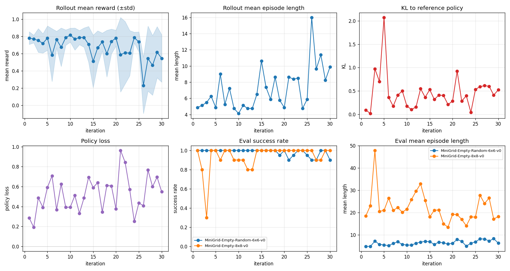
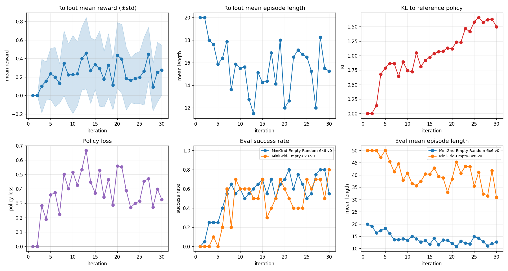
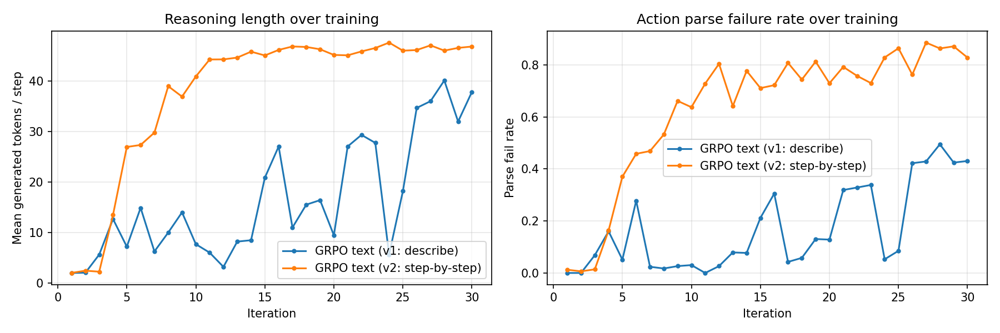
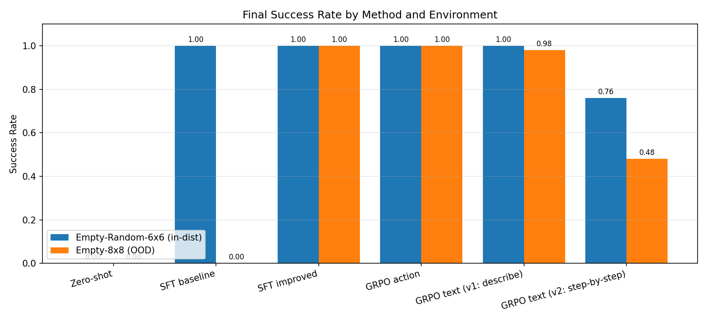
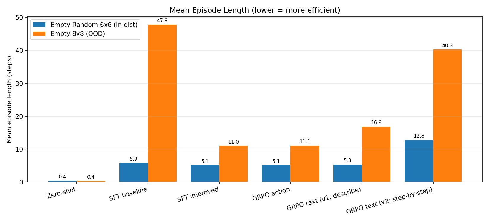

# MiniGrid NanoVLM fine-tuning

Проект реализует пайплайн дообучения (fine-tuning), который адаптирует vision-and-language модель (NanoVLM) для управления агентом в среде MiniGrid EmptyEnv.

## Методы
- **SFT** на парах (image, action) от экспертной политики: baseline + improved (балансировка действий, аугментации)
- **GRPO** с прямым выводом действия
- **GRPO** с выводом текст + действие

## Структура репозитория
```
configs/        — yaml-конфиги запусков
data/episodes/  — собранные эпизоды эксперта (PNG + actions.json)
external/       — клон nanoVLM v0.1
checkpoints/    — чекпоинты SFT и GRPO
results/        — history-логи, eval-метрики, графики
scripts/        — точки входа (CLI)
src/            — основной код
```

## Модель
Базовая модель: [lusxvr/nanoVLM-222M](https://huggingface.co/lusxvr/nanoVLM-222M) (SigLIP-base + SmolLM2-135M, ветка nanoVLM v0.1). Загрузка: `src/model.py`, функция `load_vlm` — `VisionLanguageModel.from_pretrained` из `external/nanoVLM`.

Предсказание действия — генерация текста через LM head: ответ одно слово (`left` / `right` / `forward`). Промпт: `model.prompt` в `configs/base.yaml`.

## Среда и эксперт
Среда: `MiniGrid-Empty-Random-6x6-v0` (`configs/base.yaml`, `env.name`) — случайные старт агента и цель каждый эпизод. Базовый класс — `minigrid.minigrid_env.MiniGridEnv`. Обёртка `src/env.py`, класс `MiniGridWrapper`: поверх EmptyEnv цепочка `RGBImgObsWrapper` (полный RGB в `obs["image"]`) и `ImgObsWrapper` (наблюдение — только массив изображения). Размер кадра: `height * tile_size` × `width * tile_size`, `tile_size` по умолчанию берётся из среды (32 → 192×192 для 6×6, 256×256 для 8×8).

Действия: `left` (0), `right` (1), `forward` (2). Константы и маппинг имён — в `src/env.py`.

Эксперт: `src/expert.py`, класс `ExpertPolicy`. Политика знает полную карту (`env.unwrapped.grid`), ищет клетку `goal`, строит кратчайший путь BFS по проходимым клеткам (`None`, `floor`, `goal`), выдаёт поворот или `forward` к следующей клетке пути.

## Данные
Сбор: `python scripts/collect_data.py` (параметры из `configs/base.yaml`: `data.dir`, `data.num_episodes=50`, `env.*`). `data/episodes` перезаписывается полностью.

Эксперт проходит 50 эпизодов (сиды `seed` … `seed + 49`). Для эпизода `i` создаётся каталог `data/episodes/{i:06d}/`:
- `{step:04d}.png` — RGB-наблюдение перед шагом `step`;
- `actions.json` — список действий (int 0/1/2), `action_names`, `num_steps`, `seed`.

Распределение действий в собранных данных: `forward=145`, `left=42`, `right=38` — сильный bias к `forward`, что мотивирует балансировку в improved SFT.

Логика сбора: `src/data_collection.py` (`collect_episode`, `collect_dataset`).

## Установка
```bash
python -m venv .venv
source .venv/bin/activate
pip install -r requirements.txt
git clone --branch v0.1 --depth 1 https://github.com/huggingface/nanoVLM.git external/nanoVLM
```

## SFT-обучение
Универсальный трейнер: `src/sft_trainer.py`, функция `train_sft`. CLI: `python scripts/train_sft.py --config <yaml>`. Конфиги:
- `configs/sft_baseline.yaml` — без улучшений
- `configs/sft_improved.yaml` — с балансировкой и аугментациями

DataLoader поверх `MiniGridActionDataset` с `ActionCollator`. Опционально `WeightedRandomSampler` для балансировки действий (если `balance_actions: true`). Оптимизатор AdamW, cosine LR с warmup, gradient clipping. Loss через `VisionLanguageModel.forward(input_ids, images, attention_mask, targets)` — cross-entropy на токенах ответа, prompt маскируется `-100`.

`ActionCollator` (`src/dataset.py`): токенизирует prompt и answer раздельно, конкатенирует id'шники, строит labels `[-100] * len(prompt) + list(answer)`, right-padding до max длины в батче, shift labels влево на 1.

После каждой эпохи — multi-env eval через `evaluate_policy_multi` (`src/evaluate.py`) на списке сред из `eval_envs`. Чекпоинт сохраняется по success rate среды `primary_eval_env`.

## Результаты SFT
### Стенд
Тренировка на 50 эпизодах из `MiniGrid-Empty-Random-6x6-v0`. Eval после каждой эпохи на двух средах:
- **in-distribution**: `MiniGrid-Empty-Random-6x6-v0` (20 эпизодов, сиды 10000..10019, max_steps=20)
- **OOD**: `MiniGrid-Empty-8x8-v0` (10 эпизодов, max_steps=50; среда детерминированная — фиксированные старт и цель)

Финальная оценка best-чекпоинта: 50 эпизодов на каждой среде.

### Baseline (без улучшений)
Конфиг: `configs/sft_baseline.yaml`. 10 эпох, batch=16, lr=2e-5, без аугментаций и балансировки.

| Среда | Success Rate | Mean Return | Mean Length |
|---|---:|---:|---:|
| 6×6 (in-dist) | 1.00 | 0.78 | 4.92 |
| 8×8 (OOD)     | 0.00 | 0.00 | 50.0 |

На 6×6 модель достигает SR=1.0 после 3 эпох. На 8×8 — полный коллапс: на best-чекпоинте все 2500 шагов = `left`, агент крутится на месте. Причины: bias к `forward` в train-данных + distribution shift (картинки 8×8 = 256×256, train — 192×192).

### Improved (с улучшениями)
Конфиг: `configs/sft_improved.yaml`. Те же гиперпараметры + три улучшения:

1. **Балансировка действий через `WeightedRandomSampler`** — равные веса по классам (left/right/forward), убирает bias к forward.
2. **`RandomResizedCrop(scale=0.6-1.0)`** — эмулирует разные масштабы сцены, что компенсирует разницу 192×192 (6×6) vs 256×256 (8×8).
3. **ColorJitter + RandomGrayscale + RandomErasing** — устойчивость к визуальным вариациям.

Best-чекпоинт выбирается по SR на 8×8 (`primary_eval_env`).

| Среда | Success Rate | Mean Return | Mean Length |
|---|---:|---:|---:|
| 6×6 (in-dist) | 1.00 | 0.78 | 4.84 |
| 8×8 (OOD)     | **1.00** | 0.80 | 11.0 |

На 8×8 SR вырос с 0.0 до 1.0. Mean length 11.0 близок к оптимальному пути BFS (5 forward + 1 right + 5 forward = 11 шагов). На 6×6 качество не просело.

### Сравнение


### Наблюдения
- **Решающий фактор для OOD — RandomResizedCrop.** Без него (только балансировка + ColorJitter) SR на 8×8 оставался 0.0: модель просто меняла коллапс с «всё forward» на «всё left» или «left/right поровну».
- **Чекпоинт нестабилен по эпохам.** Модель находит решение на 8×8 примерно на эпохе 8, до этого SR=0. `save_best` по `primary_eval_env=8×8` обязателен.
- **8×8 — детерминированная среда** (фиксированные старт и цель), поэтому SR=1.0 означает «модель решает одну OOD-сцену», а не «обобщается на любую 8×8».

## GRPO action-only
RL fine-tuning поверх SFT improved. Идея GRPO: вместо value-сети для оценки advantage'а собираем **группу** из `G` эпизодов с одинаковым промптом и нормируем reward внутри группы:

```
A_i = (R_i - mean(R)) / (std(R) + eps)
```

Policy loss — PPO clip:
```
L_policy = -min(ratio_t * A_i, clip(ratio_t, 1-ε, 1+ε) * A_i)
ratio_t = exp(log π_θ(a_t|s_t) - log π_old(a_t|s_t))
```

KL к референсной политике:
```
KL ≈ exp(log π_ref - log π) - (log π_ref - log π) - 1
```

Финальный loss: `L = L_policy + β·KL`.

### Реализация
- `src/rollout.py` — `sample_episode` (one-token argmax/sampling из action-токенов с температурой), `compute_log_probs` (log p(a_t) только на трёх токенах действий), `get_action_token_ids` (проверка, что каждое слово токенизируется в один токен).
- `src/grpo_trainer.py` — `train_grpo`: rollout группы из `group_size` эпизодов с разными seed'ами, нормализация advantage'ов, `inner_epochs` проходов PPO clip + KL-штраф, AdamW, clip grad norm, eval на нескольких средах, save_best по primary env.
- `scripts/train_grpo_action.py` / `scripts/eval_grpo_action.py` — точки входа.

### Гиперпараметры (configs/grpo_action.yaml)
- `num_iterations: 30`, `group_size: 8`, `inner_epochs: 2`
- `lr: 5e-7` (на два порядка меньше SFT, чтобы не уезжать от SFT-оптимума)
- `clip_eps: 0.2`, `kl_beta: 0.1`, `temperature: 1.0`, `max_grad_norm: 1.0`
- Старт: `sft_checkpoint: checkpoints/sft_improved/sft_improved_best.pt`
- Reference policy — копия SFT improved, заморожена.

### Reward
Reward — финальный return эпизода в MiniGrid: `1 - 0.9 * (steps / max_steps)` при достижении цели, 0 иначе. 

### Результаты GRPO
Финальная оценка best-чекпоинта (50 эпизодов):

| Среда | Success Rate | Mean Return | Mean Length |
|---|---:|---:|---:|
| 6×6 (in-dist) | 1.00 | 0.78 | 4.80 |
| 8×8 (OOD)     | 1.00 | 0.80 | 11.0  |

GRPO **сохранил качество SFT improved на обеих средах**, но не дал прироста (что и ожидаемо: SFT уже близок к оптимуму).

### Кривые обучения


### Наблюдения
- **Часто `policy_loss ≈ 0` и `kl ≈ 0`** (например, iter 4-10). Причина - на первом inner epoch `new_log_probs == old_log_probs` → `ratio = 1`. С normalized advantages (mean=0), surrogate loss `-min(1·A, clip(1)·A).mean() = -mean(A) = 0`. Чтобы получить обновление, нужны либо большие `inner_epochs`, либо разнообразие rewards в группе.
- **Резкие шаги при срабатывании.** На iter 11 произошло обновление, которое сместило политику на 8×8 в коллапс `forward only` (SR=0.0).
- **Восстановление.** К iter 13 политика вернулась к SFT-режиму (SR=1.0 на обеих средах). KL-штраф к референсу удерживает политику в окрестности SFT.
- **Для слабого baseline'а GRPO имел бы больший потенциал.** SFT improved уже решает задачу — RL только стабилизирует, но не улучшает.

## GRPO text+action

Расширение GRPO: модель сначала генерирует свободный текст (reasoning), затем извлекаем действие парсингом последнего вхождения слова `left`/`right`/`forward`. Мотивация: проверить, может ли RL без supervision на формат вывода научить модель полезному chain-of-thought.

### Реализация

- `src/rollout_text.py` — отдельный модуль для text-режима:
  - `sample_episode_text` — токен-за-токеном генерация (`_generate_step`) с sampling и температурой до `max_new_tokens` или EOS, сохранение `gen_texts` для verbose-логирования.
  - `parse_last_action` — извлечение действия по последнему вхождению `left`/`right`/`forward` в сгенерированном тексте. При неудаче — fallback на `forward` + инкремент `parse_fails`.
  - `compute_log_probs_text` — log p всех сгенерированных токенов и entropy по словарю; общая функция `_forward_logits_grad` поддерживает оба режима (с/без градиента).
- `src/grpo_text_trainer.py`, функция `train_grpo_text` — отдельный трейнер для text-варианта. Отличия от action-only:
  - переменное число сгенерированных токенов на шаг (отдельный backward на каждом шаге эпизода);
  - per-token PPO clip loss + KL к референсу + опциональный entropy bonus;
  - доп. метрики в history: `parse_fail_rate`, `mean_gen_tokens`, `entropy`;
  - `verbose_every` для печати примеров генерации (action + текст).
- `scripts/train_grpo_text.py` — точка входа, выбор конфига через `--config`.

### Эксперименты

Два варианта с разными промптами, идентичные гиперпараметры (старт от `sft_improved_best.pt`):

| Вариант | Промпт |
|---|---|
| **v1** | `"Describe what you see, then choose action: left, right, forward."` |
| **v2** | `"Think step by step about where the goal is, then output action: left, right, forward."` |

Идея v1 - описание состояния в свободной форме.
Идея v2 - описание цели и её пошаговое достижение (более строгий промпт).

Гиперпараметры (`configs/grpo_text_v1.yaml`, `grpo_text_v2.yaml`):
- `num_iterations: 30`, `group_size: 8`, `inner_epochs: 2`
- `lr: 5e-7`, `kl_beta: 0.1`, `clip_eps: 0.2`, `max_grad_norm: 1.0`
- `temperature: 1.2` (выше чем в action-only — для exploration в формате текста)
- `ent_beta: 0.0` (см. ниже)
- `max_new_tokens: 48`

### Подбор `ent_beta`

Изначально пробовалось `ent_beta=0.01` для поощрения разнообразия генераций. Результат — коллапс за 5 итераций: энтропия выросла с 0.17 до 3.8, `parse_fail_rate` с 0% до 66%, reward с 0.78 до 0.48. Причина: entropy bonus считается по всему словарю (~50K токенов), и сигнал «увеличь энтропию» доминирует над sparse reward задачи. Финальные запуски — без entropy bonus, exploration только через `temperature`.

### Результаты

Финальная оценка best-чекпоинтов (50 эпизодов):

| Вариант | 6×6 SR | 6×6 len | 8×8 SR | 8×8 len | parse_fail | gen_tok |
|---|---:|---:|---:|---:|---:|---:|
| **v1** (describe) | 1.00 | 5.34 | 0.98 | 16.86 | 0.7% / 1.9% | 2.3 / 2.2 |
| **v2** (step-by-step) | 0.76 | 12.82 | 0.48 | 40.26 | 63.5% / 62.5% | 41.4 / 39.3 |

### v1: формально работает, но без reasoning

`mean_gen_tokens=2.2-2.3` — модель сразу выдаёт action-слово, 1-2 токена, без описания сцены. Это и не могло быть иначе: SFT improved обучен на формате «answer одним словом», и GRPO с sparse reward не имеет сигнала сменить формат.

Кривые обучения показывают дрейф длины генерации: на отдельных итерациях модель начинает писать длиннее (до 20-40 токенов), parse_fail растёт до 20-40%, reward падает — затем модель «откатывается» к коротким ответам через KL-штраф. Best-чекпоинт сохраняется на ранних итерациях, когда поведение ближе всего к SFT.

Verbose-семплы из rollout'ов на разных итерациях (`scripts/train_grpo_text.py` + `verbose_every` в конфиге):

```
iter 10 (короткий режим):
  step 0: action=forward | gen="forward"
  step 1: action=forward | gen="forward"
  step 2: action=right   | gen="right"

iter 15 (дрейф к длинным генерациям):
  step 0: action=forward | gen="Enter file version sources into the Discuss file version source box."
  step 1: action=right   | gen="Math_ behaves less well in reverse also because you type it in..."
  step 2: action=forward | gen="forwardwave tributary NO 12 SHORE WAARDSHIP ONLY REGARDING PM 10..."
```

Когда модель уходит из «short answer» режима, она генерирует не описания сцены, а случайные фрагменты из претрейн-распределения SmolLM2 — никакой связи с MiniGrid.

### v2: коллапс с первой итерации

Промпт «think step by step» сильно отличается от SFT-формата ответа. С первой же итерации SR на rollout = 0.0 (reward 0.000), модель пишет 2 «случайных» токена которые не парсятся. KL быстро растёт до 1.6+, энтропия до 7.5, parse_fail до 87%. Модель уходит от SFT-инициализации, но не находит политику с положительным reward'ом.

Verbose-семплы:

```
iter 25 (полный коллапс):
  step 0: action=forward | gen="Forward direction directed positive fan  Ank password carbs make..."
  step 1: action=forward | gen="SUit?: droplet onto window area Hill Reach declined buyers..."
  step 2: action=forward | gen="NE Java ObjectThe obligation(( fastforward"
  ...
```

### Кривые обучения





### Наблюдения

- **RL без SFT-bootstrap не создаёт новый формат вывода.** Sparse reward (1/0 за эпизод) даёт сигнал «правильное действие важно», но не «формат рассуждения важен». Чтобы научить reasoning'у, нужен этап SFT на (image, reasoning_text + action) парах перед GRPO.
- **Промпт должен быть близок к SFT-формату.** v1 (describe ... then choose) ближе к «What action ... Answer:» из SFT и держит политику в рабочем режиме. v2 («think step by step») слишком далёк → политика разваливается.
- **KL-штраф недостаточен против сильного prompt-shift.** В v2 `kl_beta=0.1` не удержал политику от ухода в шумовой режим.
- **Eval часто стабильнее rollout.** В v1 на rollout parse_fail доходил до 40-50%, на eval (с temperature=1.0 вместо 1.2) — оставался 1-2%. Низкая температура «спасает» формат, но не помогает обучению.

## Финальное сравнение всех методов (50 эпизодов на среду)

| Method | Empty-Random-6x6 (in-dist) SR | len | Empty-8x8 (OOD) SR | len |
|---|---|---|---|---|
| Zero-shot | 0.00 | 0.4 | 0.00 | 0.4 |
| SFT baseline | 1.00 | 5.9 | 0.00 | 47.9 |
| SFT improved | 1.00 | 5.1 | 1.00 | 11.0 |
| GRPO action | 1.00 | 5.1 | 1.00 | 11.1 |
| GRPO text (v1: describe) | 1.00 | 5.3 | 0.98 | 16.9 |
| GRPO text (v2: step-by-step) | 0.76 | 12.8 | 0.48 | 40.3 |




Ключевые выводы:
- **SFT improved уже близок к потолку задачи.** GRPO action даёт идентичные метрики — RL без зазора для улучшения только стабилизирует политику.
- **Zero-shot полностью неработоспособен**: модель не выдаёт `left/right/forward` ни в одном эпизоде (action distribution: 100% "other").
- **GRPO text v1 сохраняет качество, но не учит reasoning'у** — best-чекпоинт по сути воспроизводит SFT improved.
- **GRPO text v2 — провальный эксперимент** drift от SFT-формата.

## Файлы
- `src/sft_trainer.py` — SFT-трейнер с балансировкой и multi-env eval
- `src/grpo_trainer.py` — GRPO-трейнер
- `src/rollout.py` — sampling эпизодов и log-probs над action-токенами
- `src/dataset.py` — `MiniGridActionDataset`, аугментации, `get_sample_weights()`
- `src/evaluate.py` — `evaluate_policy` и `evaluate_policy_multi`
- `src/plotting.py` — графики SFT, GRPO и сравнение baseline vs improved
- `configs/sft_baseline.yaml`, `configs/sft_improved.yaml`, `configs/grpo_action.yaml`
- `results/*.json` — истории и финальные eval'ы
- `results/sft_comparison.png`, `results/grpo_action_history_curves.png` — графики
- `src/rollout_text.py` — генерация эпизодов в text-режиме, парсинг действий, log-probs всех токенов
- `src/grpo_text_trainer.py` — GRPO-трейнер для text+action режима
- `scripts/train_grpo_text.py`, `scripts/eval_grpo_text.py` — точки входа для text-режима
- `scripts/eval_all.py`, `scripts/make_plots.py` — финальная сравнительная оценка и сводные графики
- `configs/grpo_text_v1.yaml`, `configs/grpo_text_v2.yaml`
- `results/plots/` — итоговые графики и таблица сравнения

## Воспроизведение

Полный пайплайн целиком:

```bash
# 0. Установка
pip install -r requirements.txt
git clone --branch v0.1 --depth 1 https://github.com/huggingface/nanoVLM.git external/nanoVLM

# 1. Сбор данных (50 эпизодов эксперта в data/episodes/)
python scripts/collect_data.py

# 2. SFT baseline
python scripts/train_sft.py --config configs/sft_baseline.yaml
python scripts/eval_sft.py \
    --checkpoint checkpoints/sft_baseline/sft_baseline_best.pt \
    --env MiniGrid-Empty-Random-6x6-v0 --max-steps 20 --episodes 50 \
    --out results/sft_baseline_eval_6x6.json
python scripts/eval_sft.py \
    --checkpoint checkpoints/sft_baseline/sft_baseline_best.pt \
    --env MiniGrid-Empty-8x8-v0 --max-steps 50 --episodes 50 \
    --out results/sft_baseline_eval_8x8.json
python src/plotting.py --history results/sft_baseline_history.json

# 3. SFT improved
python scripts/train_sft.py --config configs/sft_improved.yaml
python scripts/eval_sft.py \
    --checkpoint checkpoints/sft_improved/sft_improved_best.pt \
    --env MiniGrid-Empty-Random-6x6-v0 --max-steps 20 --episodes 50 \
    --out results/sft_improved_eval_6x6.json
python scripts/eval_sft.py \
    --checkpoint checkpoints/sft_improved/sft_improved_best.pt \
    --env MiniGrid-Empty-8x8-v0 --max-steps 50 --episodes 50 \
    --out results/sft_improved_eval_8x8.json
python src/plotting.py --history results/sft_improved_history.json
python src/plotting.py \
    --compare-baseline results/sft_baseline_history.json \
    --compare-improved results/sft_improved_history.json

# 4. GRPO action-only (старт от SFT improved)
python scripts/train_grpo_action.py --config configs/grpo_action.yaml
python scripts/eval_grpo_action.py \
    --checkpoint checkpoints/grpo_action/grpo_action_best.pt \
    --env MiniGrid-Empty-Random-6x6-v0 --max-steps 20 --episodes 50
python scripts/eval_grpo_action.py \
    --checkpoint checkpoints/grpo_action/grpo_action_best.pt \
    --env MiniGrid-Empty-8x8-v0 --max-steps 50 --episodes 50
python src/plotting.py --grpo-history results/grpo_action_history.json

# 5. GRPO text+action (два варианта промпта)
python scripts/train_grpo_text.py --config configs/grpo_text_v1.yaml
python scripts/train_grpo_text.py --config configs/grpo_text_v2.yaml

# 6. Финальная сводная оценка всех методов и графики
python scripts/eval_all.py --out results/eval_all.json
python scripts/make_plots.py
```

Все артефакты сохраняются в `checkpoints/` и `results/`.

## Итоги

### Что сработало

- **SFT improved решает задачу полностью.** На in-distribution (6×6) и OOD (8×8) SR=1.0 при длинах путей близких к BFS-оптимуму. Решающие факторы: `RandomResizedCrop` против distribution shift между размерами кадров и `WeightedRandomSampler` против bias к `forward` в экспертных данных.
- **GRPO action-only стабилен.** RL поверх SFT не ломает политику — KL-штраф к референсу удерживает в окрестности SFT-оптимума, и финальные метрики идентичны исходным.
- **Multi-env eval с `save_best` по primary env** оказался критичным: best-чекпоинт SFT improved на 8×8 находится только на эпохе ~8, а save_best по 6×6 не дал бы решения OOD.

### Что не сработало

- **GRPO не дал прироста над SFT improved.** Метрики идентичны (6×6: 5.14 vs 5.14 шагов, 8×8: 11.0 vs 11.1). Причина — потолок задачи: на простых 6×6/8×8 SFT уже оптимален. Reward = `1 - 0.9 * (steps/max_steps)` формально вознаграждает короткие пути, но при разбросе reward'ов внутри группы `std ≈ 0.02` нормализованные advantages — это в основном шум, а не сигнал.
- **GRPO text+action не выучил reasoning.** В обеих v1/v2 модель **не описывает сцену**:
  - v1 (`describe ... then choose`) → `mean_gen_tokens=2.2`, модель сразу выдаёт action-слово, без описания. SR сохранён, но reasoning'а нет.
  - v2 (`think step by step ...`) → коллапс с первой итерации, parse_fail 63%, SR падает до 0.48 на 8×8.
- **Entropy bonus сломал генерацию.** `ent_beta=0.01` за 5 итераций увеличил энтропию с 0.17 до 3.8, parse_fail с 0% до 66%. Entropy bonus считается по словарю SmolLM2 (~50K токенов) и доминирует над sparse task reward.

### Основные failure modes

1. **Reasoning не оптимизируется sparse reward'ом end-to-end.** Reward зависит только от действия, не от текста. Модель может писать что угодно — если действие правильное, reward одинаков. Нет градиента «опиши лучше».
2. **KL-штраф к SFT-инициализации тянет в short-answer режим.** SFT обучен генерить 1 токен. Любая попытка генерировать длиннее штрафуется KL. Получается локальный оптимум «короткий ответ», из которого GRPO не может выйти.
3. **Prompt-shift при старте RL разрушает политику.** В v2 промпт «think step by step» слишком далёк от SFT-формата «What action ... Answer:». С первой же итерации rollout SR = 0, модель уходит в шумовой режим и не возвращается — `kl_beta=0.1` не удерживает.
4. **Verbose-семплы показывают качественную картину деградации.** Когда модель уходит из short-answer режима, она генерирует фрагменты претрейн-распределения SmolLM2 (`"Math_ behaves less well in reverse..."`, `"SUit?: droplet onto window area..."`), а не описания MiniGrid-сцены. Это подтверждает: RL не создаёт reasoning, а размывает существующее поведение.

### Что попробовать дальше

#### 1. SFT bootstrap для reasoning (программно построенные описания)

Сгенерировать датасет `(image, reasoning_text, action)`, где `reasoning_text` строится из state среды по шаблону:

```python
def make_reasoning(env, action):
    agent_dir = ["right", "down", "left", "up"][env.unwrapped.agent_dir]
    dx = goal_pos[0] - agent_pos[0]
    dy = goal_pos[1] - agent_pos[1]
    return (f"I am facing {agent_dir}. Goal is {abs(dx)} cells "
            f"{'right' if dx>0 else 'left'}, {abs(dy)} cells "
            f"{'down' if dy>0 else 'up'}. Action: {action}.")
```

Pipeline:
- SFT на reasoning-парах → модель учится формату «описание + действие»
- GRPO поверх этого SFT тюнит за финальный reward, но KL уже к политике с reasoning'ом → модель не уходит из формата

Ожидаемый результат: `mean_gen_tokens` ≈ 20-30, parse_fail близок к 0, в выводе осмысленное (хотя и шаблонное) описание сцены. SR останется ≈1.0. Главный win — verbose-семплы с реальным reasoning'ом.

Минус: reasoning синтетический и шаблонный, модель учится воспроизводить шаблон, а не «думать».

#### 2. Distillation reasoning'а из VLM-учителя

Прогнать сильную VLM по 50 экспертным эпизодам с промптом «опиши что видишь и почему выбрано это действие». Получить `(image, real_reasoning, action)` → SFT → GRPO (как в варианте 1).

Плюс: разнообразный, осмысленный reasoning — модель учится не шаблону, а распределению описаний.

Минус: требует большую модель или внешний API.

#### 3. Усложнить среду — дать GRPO реальный зазор для улучшения

На Empty 6×6/8×8 SFT уже на потолке, и GRPO нечего оптимизировать. Перенос на, например, `MiniGrid-DoorKey-6x6-v0` (нужна последовательность подбери ключ → открой дверь → дойди до цели):
- SFT там даёт SR < 1.0 и не-оптимальные длины
- GRPO может реально улучшить за счёт reward'а за эффективность
- Это **отдельная проблема от reasoning'а**, но без неё нельзя честно сравнить RL vs SFT по силе метода

#### 4. Process reward за качество reasoning'а

Reward = `action_reward + λ * reasoning_quality`. Качество — например, наличие ключевых слов про объекты сцены (`goal`, `wall`, направления) + штраф за нерелевантные токены через ngram-overlap с шаблоном из (1).

Плюс: двигает в нужном направлении без SFT-bootstrap'а.

Минус: хрупко — модель может найти способ хакнуть метрику (`"goal wall left"` без смысла). 

### Главный вывод

GRPO без SFT-bootstrap'а нового формата не создаёт reasoning, а только тонко настраивает существующее поведение. Чтобы RL дал осмысленный chain-of-thought, нужен этап supervised обучения формату перед RL. Это согласуется с практикой современных reasoning-моделей, где RL применяется поверх sft модели, уже умеющей рассуждать в нужном формате.