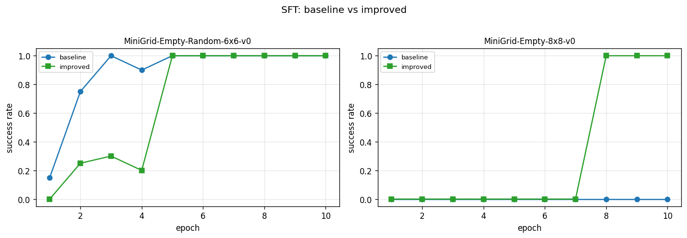
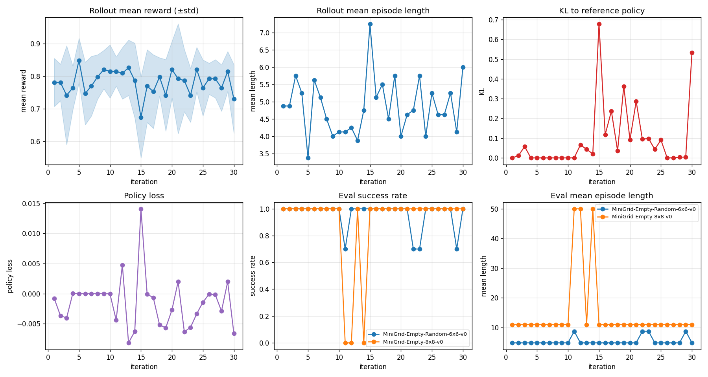

# MiniGrid NanoVLM fine-tuning

Проект реализует пайплайн дообучения (fine-tuning), который адаптирует vision-and-language модель (NanoVLM) для управления агентом в среде MiniGrid EmptyEnv.

## Методы
- **SFT** на парах (image, action) от экспертной политики: baseline + improved (балансировка действий, аугментации)
- **GRPO** с прямым выводом действия
- **GRPO** с выводом текст+ действие

## Структура репозитория
```
configs/        — yaml-конфиги запусков
data/episodes/  — собранные эпизоды эксперта (PNG + actions.json)
external/       — клон nanoVLM v0.1
checkpoints/    — чекпоинты SFT и GRPO
results/        — history-логи, eval-метрики, графики
scripts/        — точки входа (CLI)
src/            — основной код
```

## Модель
Базовая модель: [lusxvr/nanoVLM-222M](https://huggingface.co/lusxvr/nanoVLM-222M) (SigLIP-base + SmolLM2-135M, ветка nanoVLM v0.1). Загрузка: `src/model.py`, функция `load_vlm` — `VisionLanguageModel.from_pretrained` из `external/nanoVLM`.

Предсказание действия — генерация текста через LM head: ответ одно слово (`left` / `right` / `forward`). Промпт: `model.prompt` в `configs/base.yaml`.

## Среда и эксперт
Среда: `MiniGrid-Empty-Random-6x6-v0` (`configs/base.yaml`, `env.name`) — случайные старт агента и цель каждый эпизод. Базовый класс — `minigrid.minigrid_env.MiniGridEnv`. Обёртка `src/env.py`, класс `MiniGridWrapper`: поверх EmptyEnv цепочка `RGBImgObsWrapper` (полный RGB в `obs["image"]`) и `ImgObsWrapper` (наблюдение — только массив изображения). Размер кадра: `height * tile_size` × `width * tile_size`, `tile_size` по умолчанию берётся из среды (32 → 192×192 для 6×6, 256×256 для 8×8).

Действия: `left` (0), `right` (1), `forward` (2). Константы и маппинг имён — в `src/env.py`.

Эксперт: `src/expert.py`, класс `ExpertPolicy`. Политика знает полную карту (`env.unwrapped.grid`), ищет клетку `goal`, строит кратчайший путь BFS по проходимым клеткам (`None`, `floor`, `goal`), выдаёт поворот или `forward` к следующей клетке пути.

## Данные
Сбор: `python scripts/collect_data.py` (параметры из `configs/base.yaml`: `data.dir`, `data.num_episodes=50`, `env.*`). `data/episodes` перезаписывается полностью.

Эксперт проходит 50 эпизодов (сиды `seed` … `seed + 49`). Для эпизода `i` создаётся каталог `data/episodes/{i:06d}/`:
- `{step:04d}.png` — RGB-наблюдение перед шагом `step`;
- `actions.json` — список действий (int 0/1/2), `action_names`, `num_steps`, `seed`.

Распределение действий в собранных данных: `forward=145`, `left=42`, `right=38` — сильный bias к `forward`, что мотивирует балансировку в improved SFT.

Логика сбора: `src/data_collection.py` (`collect_episode`, `collect_dataset`).

## Установка
```bash
python -m venv .venv
source .venv/bin/activate
pip install -r requirements.txt
git clone --branch v0.1 --depth 1 https://github.com/huggingface/nanoVLM.git external/nanoVLM
```

## SFT-обучение
Универсальный трейнер: `src/sft_trainer.py`, функция `train_sft`. CLI: `python scripts/train_sft.py --config <yaml>`. Конфиги:
- `configs/sft_baseline.yaml` — без улучшений
- `configs/sft_improved.yaml` — с балансировкой и аугментациями

DataLoader поверх `MiniGridActionDataset` с `ActionCollator`. Опционально `WeightedRandomSampler` для балансировки действий (если `balance_actions: true`). Оптимизатор AdamW, cosine LR с warmup, gradient clipping. Loss через `VisionLanguageModel.forward(input_ids, images, attention_mask, targets)` — cross-entropy на токенах ответа, prompt маскируется `-100`.

`ActionCollator` (`src/dataset.py`): токенизирует prompt и answer раздельно, конкатенирует id'шники, строит labels `[-100] * len(prompt) + list(answer)`, right-padding до max длины в батче, shift labels влево на 1.

После каждой эпохи — multi-env eval через `evaluate_policy_multi` (`src/evaluate.py`) на списке сред из `eval_envs`. Чекпоинт сохраняется по success rate среды `primary_eval_env`.

## Результаты SFT
### Стенд
Тренировка на 50 эпизодах из `MiniGrid-Empty-Random-6x6-v0`. Eval после каждой эпохи на двух средах:
- **in-distribution**: `MiniGrid-Empty-Random-6x6-v0` (20 эпизодов, сиды 10000..10019, max_steps=20)
- **OOD**: `MiniGrid-Empty-8x8-v0` (10 эпизодов, max_steps=50; среда детерминированная — фиксированные старт и цель)

Финальная оценка best-чекпоинта: 50 эпизодов на каждой среде.

### Baseline (без улучшений)
Конфиг: `configs/sft_baseline.yaml`. 10 эпох, batch=16, lr=2e-5, без аугментаций и балансировки.

| Среда | Success Rate | Mean Return | Mean Length |
|---|---:|---:|---:|
| 6×6 (in-dist) | 1.00 | 0.78 | 4.92 |
| 8×8 (OOD)     | 0.00 | 0.00 | 50.0 |

На 6×6 модель достигает SR=1.0 после 3 эпох. На 8×8 — полный коллапс: на best-чекпоинте все 2500 шагов = `left`, агент крутится на месте. Причины: bias к `forward` в train-данных + distribution shift (картинки 8×8 = 256×256, train — 192×192).

### Improved (с улучшениями)
Конфиг: `configs/sft_improved.yaml`. Те же гиперпараметры + три улучшения:

1. **Балансировка действий через `WeightedRandomSampler`** — равные веса по классам (left/right/forward), убирает bias к forward.
2. **`RandomResizedCrop(scale=0.6-1.0)`** — эмулирует разные масштабы сцены, что компенсирует разницу 192×192 (6×6) vs 256×256 (8×8).
3. **ColorJitter + RandomGrayscale + RandomErasing** — устойчивость к визуальным вариациям.

Best-чекпоинт выбирается по SR на 8×8 (`primary_eval_env`).

| Среда | Success Rate | Mean Return | Mean Length |
|---|---:|---:|---:|
| 6×6 (in-dist) | 1.00 | 0.78 | 4.84 |
| 8×8 (OOD)     | **1.00** | 0.80 | 11.0 |

На 8×8 SR вырос с 0.0 до 1.0. Mean length 11.0 близок к оптимальному пути BFS (5 forward + 1 right + 5 forward = 11 шагов). На 6×6 качество не просело.

### Сравнение


### Наблюдения
- **Решающий фактор для OOD — RandomResizedCrop.** Без него (только балансировка + ColorJitter) SR на 8×8 оставался 0.0: модель просто меняла коллапс с «всё forward» на «всё left» или «left/right поровну».
- **Чекпоинт нестабилен по эпохам.** Модель находит решение на 8×8 примерно на эпохе 8, до этого SR=0. `save_best` по `primary_eval_env=8×8` обязателен.
- **8×8 — детерминированная среда** (фиксированные старт и цель), поэтому SR=1.0 означает «модель решает одну OOD-сцену», а не «обобщается на любую 8×8».

## GRPO action-only
RL fine-tuning поверх SFT improved. Идея GRPO: вместо value-сети для оценки advantage'а собираем **группу** из `G` эпизодов с одинаковым промптом и нормируем reward внутри группы:

```
A_i = (R_i - mean(R)) / (std(R) + eps)
```

Policy loss — PPO clip:
```
L_policy = -min(ratio_t * A_i, clip(ratio_t, 1-ε, 1+ε) * A_i)
ratio_t = exp(log π_θ(a_t|s_t) - log π_old(a_t|s_t))
```

KL к референсной политике:
```
KL ≈ exp(log π_ref - log π) - (log π_ref - log π) - 1
```

Финальный loss: `L = L_policy + β·KL`.

### Реализация
- `src/rollout.py` — `sample_episode` (one-token argmax/sampling из action-токенов с температурой), `compute_log_probs` (log p(a_t) только на трёх токенах действий), `get_action_token_ids` (проверка, что каждое слово токенизируется в один токен).
- `src/grpo_trainer.py` — `train_grpo`: rollout группы из `group_size` эпизодов с разными seed'ами, нормализация advantage'ов, `inner_epochs` проходов PPO clip + KL-штраф, AdamW, clip grad norm, eval на нескольких средах, save_best по primary env.
- `scripts/train_grpo_action.py` / `scripts/eval_grpo_action.py` — точки входа.

### Гиперпараметры (configs/grpo_action.yaml)
- `num_iterations: 30`, `group_size: 8`, `inner_epochs: 2`
- `lr: 5e-7` (на два порядка меньше SFT, чтобы не уезжать от SFT-оптимума)
- `clip_eps: 0.2`, `kl_beta: 0.1`, `temperature: 1.0`, `max_grad_norm: 1.0`
- Старт: `sft_checkpoint: checkpoints/sft_improved/sft_improved_best.pt`
- Reference policy — копия SFT improved, заморожена.

### Reward
Reward — финальный return эпизода в MiniGrid: `1 - 0.9 * (steps / max_steps)` при достижении цели, 0 иначе. 

### Результаты GRPO
Финальная оценка best-чекпоинта (50 эпизодов):

| Среда | Success Rate | Mean Return | Mean Length |
|---|---:|---:|---:|
| 6×6 (in-dist) | 1.00 | 0.78 | 4.80 |
| 8×8 (OOD)     | 1.00 | 0.80 | 11.0  |

GRPO **сохранил качество SFT improved на обеих средах**, но не дал прироста (что и ожидаемо: SFT уже близок к оптимуму).

### Кривые обучения


### Наблюдения
- **Часто `policy_loss ≈ 0` и `kl ≈ 0`** (например, iter 4-10). Причина - на первом inner epoch `new_log_probs == old_log_probs` → `ratio = 1`. С normalized advantages (mean=0), surrogate loss `-min(1·A, clip(1)·A).mean() = -mean(A) = 0`. Чтобы получить обновление, нужны либо большие `inner_epochs`, либо разнообразие rewards в группе.
- **Резкие шаги при срабатывании.** На iter 11 произошло обновление, которое сместило политику на 8×8 в коллапс `forward only` (SR=0.0).
- **Восстановление.** К iter 13 политика вернулась к SFT-режиму (SR=1.0 на обеих средах). KL-штраф к референсу удерживает политику в окрестности SFT.
- **Для слабого baseline'а GRPO имел бы больший потенциал.** SFT improved уже решает задачу — RL только стабилизирует, но не улучшает.

## Сравнение SFT vs GRPO (финальный eval, 50 эпизодов)

| Метод | 6×6 SR | 6×6 len | 8×8 SR | 8×8 len |
|---|---:|---:|---:|---:|
| SFT baseline   | 1.00 | 4.92 | 0.00 | 50.0 |
| SFT improved   | 1.00 | 4.84 | 1.00 | 11.0 |
| GRPO action    | 1.00 | 4.80 | 1.00 | 11.0 |

## Файлы
- `src/sft_trainer.py` — SFT-трейнер с балансировкой и multi-env eval
- `src/grpo_trainer.py` — GRPO-трейнер
- `src/rollout.py` — sampling эпизодов и log-probs над action-токенами
- `src/dataset.py` — `MiniGridActionDataset`, аугментации, `get_sample_weights()`
- `src/evaluate.py` — `evaluate_policy` и `evaluate_policy_multi`
- `src/plotting.py` — графики SFT, GRPO и сравнение baseline vs improved
- `configs/sft_baseline.yaml`, `configs/sft_improved.yaml`, `configs/grpo_action.yaml`
- `results/*.json` — истории и финальные eval'ы
- `results/sft_comparison.png`, `results/grpo_action_history_curves.png` — графики

## Воспроизведение

Полный пайплайн целиком:

```bash
# 0. Установка
pip install -r requirements.txt
git clone --branch v0.1 --depth 1 https://github.com/huggingface/nanoVLM.git external/nanoVLM

# 1. Сбор данных (50 эпизодов эксперта в data/episodes/)
python scripts/collect_data.py

# 2. SFT baseline
python scripts/train_sft.py --config configs/sft_baseline.yaml
python scripts/eval_sft.py \
    --checkpoint checkpoints/sft_baseline/sft_baseline_best.pt \
    --env MiniGrid-Empty-Random-6x6-v0 --max-steps 20 --episodes 50 \
    --out results/sft_baseline_eval_6x6.json
python scripts/eval_sft.py \
    --checkpoint checkpoints/sft_baseline/sft_baseline_best.pt \
    --env MiniGrid-Empty-8x8-v0 --max-steps 50 --episodes 50 \
    --out results/sft_baseline_eval_8x8.json
python src/plotting.py --history results/sft_baseline_history.json

# 3. SFT improved
python scripts/train_sft.py --config configs/sft_improved.yaml
python scripts/eval_sft.py \
    --checkpoint checkpoints/sft_improved/sft_improved_best.pt \
    --env MiniGrid-Empty-Random-6x6-v0 --max-steps 20 --episodes 50 \
    --out results/sft_improved_eval_6x6.json
python scripts/eval_sft.py \
    --checkpoint checkpoints/sft_improved/sft_improved_best.pt \
    --env MiniGrid-Empty-8x8-v0 --max-steps 50 --episodes 50 \
    --out results/sft_improved_eval_8x8.json
python src/plotting.py --history results/sft_improved_history.json
python src/plotting.py \
    --compare-baseline results/sft_baseline_history.json \
    --compare-improved results/sft_improved_history.json

# 4. GRPO action-only (старт от SFT improved)
python scripts/train_grpo_action.py --config configs/grpo_action.yaml
python scripts/eval_grpo_action.py \
    --checkpoint checkpoints/grpo_action/grpo_action_best.pt \
    --env MiniGrid-Empty-Random-6x6-v0 --max-steps 20 --episodes 50
python scripts/eval_grpo_action.py \
    --checkpoint checkpoints/grpo_action/grpo_action_best.pt \
    --env MiniGrid-Empty-8x8-v0 --max-steps 50 --episodes 50
python src/plotting.py --grpo-history results/grpo_action_history.json
```

Все артефакты сохраняются в `checkpoints/` и `results/`.